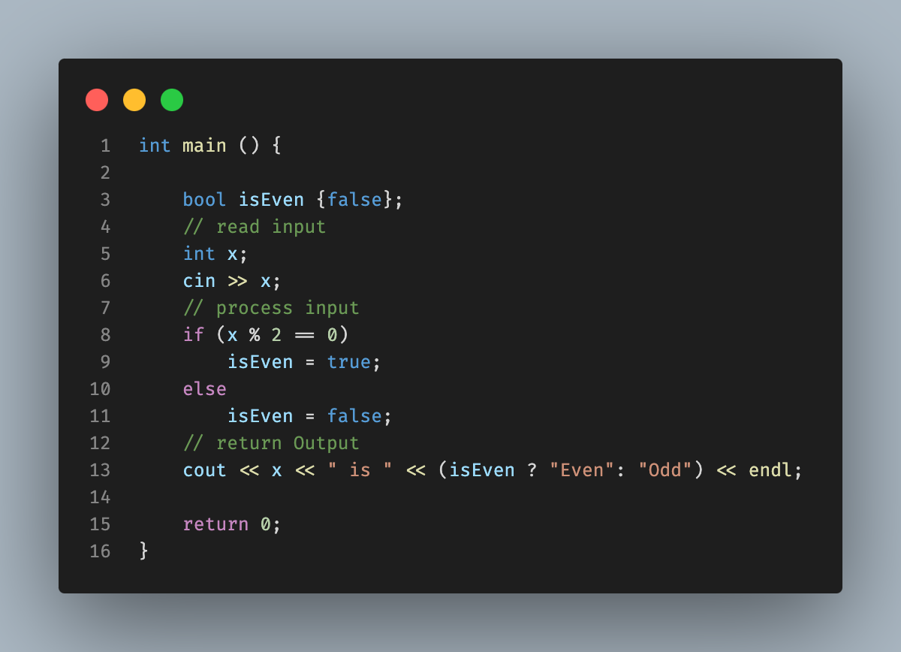
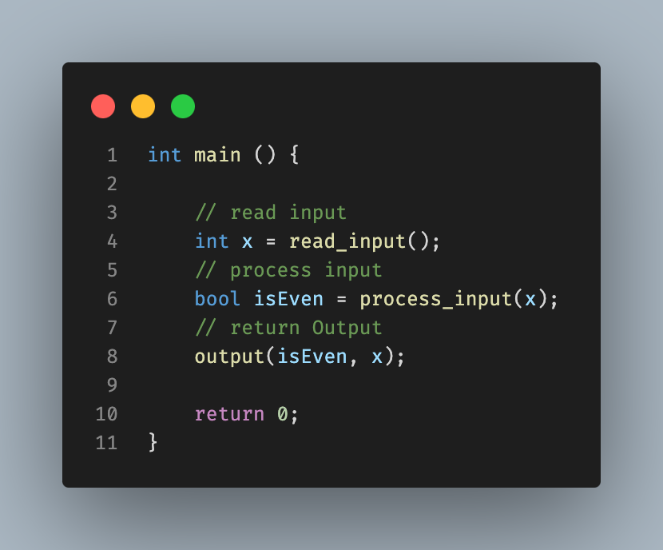
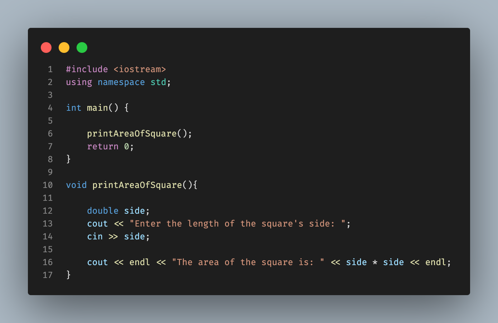

# Functions

C++ functions allows us to modularize our program code, It allows us to break code into logical self-contained units. These units can be resused multiple times in the program.

| Without Functions | With Functions |
| --- | --- |
|  |  |

Functions uses the ***Boss-Worker*** analogy, where the boss is the main program and the workers are the functions. The main program calls the functions to perform a specific task.

When you are calling functions in C++, you need to understand the following:

- What it does
- What it needs
- What it returns
- What errors it might produce
- Any constraints on its use

You won't need to know how the functions works internally to use it in your program, unless you are the one who wrote the function. C++ provides us with a lot of libraries that are filled up with loads of functions that you can use in your program.

> [!IMPORTANT]
> Don't reinvent the wheel, if there is a function that does what you want, use it.

## Function Definition

In this section, we define how the function would works, what it needs, returns, errors it might produce and any constraints on its use and to achieve this, There are some rules that we need to follow:

- Name of the function

  - The rules for naming a function are the same as the rules for naming a variable **(look at [Variables & Constants branch](https://github.com/MagedGDEV/CppInsights/tree/variables) for more information)**.
  - The name of the function should be descriptive and should reflect the purpose of the function so that it is easy to understand what the function does just by looking at its name, such as: (`calculateArea`, `calculateVolume`, `calculateSum`, etc).

- Return type

  - The return type of the function is the type of the value that the function returns at the end of it's execution, such as: `int`, `double`, `float`, `char`, `string`, `bool`, etc.
  - If the function does not return any value, then the return type of the function is `void`.

- Parameters

  - The parameters are the values that the function needs to perform its task. The parameters are optional.
  - If the function does not need any value to perform its task, then the function does not need any parameters.
  - The parameters are enclosed in parentheses `()` and separated by commas `,`. The parameters are defined by their type and name, such as: `int length`, `double radius`, `char letter`, etc.

- Function Body

  - The function body is the block of code that performs the task of the function. The function body is enclosed in curly braces `{}`. The function body contains the code that performs the task of the function.

- Return Statement

  - The return statement is used to return a value from the function.
  - If the return type of the function is `void`, then the return statement may not be used.
  - If the return type of the function is not `void`, then the return statement must be used to return a value of the same type as the return type of the function.

The syntax of the function definition is as follows:

```cpp
return_type function_name(parameters) {
    // function body
    // return statement
}
```

The following example shows different function definitions:

```cpp
// Function that does not return any value and does not need any parameter
void printHello() {
    cout << "Hello, World!" << endl;
}

// Function that does not return any value and needs two parameters
void printSum(int a, int b) {
    cout << "The sum of " << a << " and " << b << " is " << a + b << endl;
}

// Function that returns an integer value and needs two parameters
int calculateSum(int a, int b) {
    return a + b;
}

// Function that does not return ant value and needs a parameter
void printAreaOfSquare(double side) {
    cout << "The area of the square with side " << side << " is " << side * side << endl;
}
```

To call a function, you simply write the name of the function followed by parentheses `()` and the values of the parameters (if any). The following example shows how to call the previous functions:

```cpp
int main() {
    printHello(); // Output: Hello, World!
    printSum(5, 3); // Output: The sum of 5 and 3 is 8
    cout << calculateSum(5, 3) << endl; // Output: 8
    printAreaOfSquare(5); // Output: The area of the square with side 5 is 25
    return 0;
}
```

> [!CAUTION]
> The function must be defined before it is called (before main function). If the function is defined after it is called, the compiler will produce an error because it does not know the definition of the function.

| Error | Solution |
| --- | --- |
|  |  |

## Function Prototypes

As the program grows, the number of functions will increase and the function definitions will be scattered throughout the program. This makes the program difficult to read and understand. To solve this problem, we can use function prototypes.

The function prototype is a declaration of the function that tells the compiler about the function name, return type, and parameters. The function prototype does not contain the function body. The function prototype is used to tell the compiler about the function before the function is called.

The syntax of the function prototype is as follows:

```cpp
return_type function_name(parameters);
```

The following example shows how to use function prototypes:

```cpp
// Function prototypes
void printHello();
void printSum(int a, int b);;

int main() {

    printHello(); // Output: Hello, World!
    printSum(5, 3); // Output: The sum of 5 and 3 is 8
    return 0;
}

// Function definitions
void printHello() {
    cout << "Hello, World!" << endl;
}

void printSum(int a, int b) {
    cout << "The sum of " << a << " and " << b << " is " << a + b << endl;
}
```

You do not need to use function prototypes if the function is defined before it is called. However, it is a good practice to use function prototypes to make the program more readable and understandable.

In the prototype, you only need to specify the function name, return type, and parameters. You do not need to specify the parameter names. The following example shows the function prototype for the `calculateSum` function:

```cpp
int calculateSum(int, int);
```

> [!TIP]
> But it is good practice to specify the parameter names in the function prototype for documentation and better understanding of the function.

## Function Parameters

Data passed into a function are called **parameters** at the function definition and **arguments** at the function call. The parameters and arguments must match in number, order and in type.

> [!NOTE]
> The data type at the function call may be different from the type at the function definition as long as the compiler is able to convert the type of the argument to the type of the parameter, such as: (`int` into `double` or `C Strings` into `string`).

The data transferred into the functions are ***passed by value***, which means that the function receives a copy of the data and stored at another location in the memory. Whatever changes made to the parameter inside the function does not affect the original value at the function call (at the main function).

The following example explains how the parameters, arguments and passing data by value works:

```cpp
void multiplyByTen(int number);

int main() {
    int number = 5;
    cout << "Before the function: " << number << endl; // Output: Before the function: 5
    multiplyByTen(number); // Output: Inside the function: 50
    cout << "Outside the function: " << number << endl; // Output: Outside the function: 5
    return 0;
}

void multiplyByTen(int number) {
    number *= 10;
    cout << "Inside the function: " << number << endl;
}
```

## Return Statements

The return statement is used to return a value from the function, and it can be placed anywhere in the body of the function. When the `return` statement is executed, the function is terminated.

When the function does not return a value (**`void`**), the `return` statement can still be used to terminate the function according to some conditions. Multiple of `return` statements can be used in the same function, but only one of them will be executed.

The following example shows how to use the `return` statement in different situations:

```cpp
int max(int a, int b);
void printAreaOfSquare(double side);

int main() {
    cout << max(5, 3) << endl; // Output: 5
    printAreaOfSquare(5); // Output: The area of the square with side 5 is 25
    printAreaOfSquare(-5); // Output: The side of the square must be positive
    return 0;
}

int max(int a, int b) {
    if (a > b) {
        return a;
    }
    return b;
}

void printAreaOfSquare(double side) {
    if (side <= 0) {
        cout << "The side of the square must be positive" << endl;
        return; // The function is terminated
    }
    cout << "The area of the square with side " << side << " is " << side * side << endl;
}
```

## Default Arguments

At a function call, all arguments must be provided, but in some cases we may want to provide same value for multiple function calls. C++ provided us with a solution to add default values for parameters in the function definition or function prototype.

After adding default values for parameters, the function call can be made without providing the value for the parameters with default values. If the value is provided, it will override the default value.

We can add as many default values as we want, and we have one rule to follow which is: ***All the parameters with default values must be at the end of the parameter list***.

The following example shows how to use default arguments:

```cpp
void printSum(int a, int b, char symbol = '+');

int main() {
    printSum(5, 3); // Output: 5 + 3 = 8
    printSum(5, 3, '-'); // Output: 5 - 3 = 2
    return 0;
}

void printSum(int a, int b, char symbol) {
    cout << a << " " << symbol << " " << b << " = " << (symbol == '+' ? a + b : a - b) << endl;
}
```

> [!NOTE]
> Sort the parameters with default values according to their importance and the probability of being provided by the user by placing the most important parameters at the beginning of the parameter list and the least important parameters at the end of the parameter list. Because at calling function, we can't skip parameters in the middle and provide the value for the last parameter only.

## Overloading Functions

C++ allows us to define multiple functions with the same name but with different parameters. This is called ***function overloading***. The functions with the same name must have different parameters, such as:

- Different number of parameters
- Different types of parameters
- Different order of parameters.

This is an **Abstraction** technique, where the function name is the same but the parameters are different and the body of the functions can be different. The function call will be matched with the function definition according to the number and types of the parameters.

The following example shows how to use function overloading:

```cpp
int max(int a, int b);
double max(double a, double b);
int max(int a, int b, int c);

int main() {
    cout << max(5, 3) << endl; // Output: 5
    cout << max(5.5, 3.3) << endl; // Output: 5.5
    cout << max(5, 3, 7) << endl; // Output: 7
    return 0;
}

int max(int a, int b) {
    return a > b ? a : b;
}

double max(double a, double b) {
    return a > b ? a : b;
}

int max(int a, int b, int c) {
    return max(max(a, b), c);
}
```

Parameters with default values can be used in function overloading, but the function call will be matched with the function definition according to the number and types of the parameters, not the default values, so you need to be careful when using default values with function overloading. For example:

```cpp
void print(int a = 100);
void print(double a = 100.0);

int main() {
    print(); // Ambiguous
    return 0;
}

void print(int a) {
    cout << a << endl;
}

void print(double a) {
    cout << a << endl;
}
```

The above code will give an error because the compiler does not know which function to call because the function call matches both function definitions.

## Passing Arrays to Functions

When an array is passed to a function, the function receives the location of the first element of the array. The function can access the elements of the array using the location of the first element, this leads to the fact that the function can change the elements of the array.

>[!IMPORTANT]
> The function does not know the size of an array unless you pass it to the function.

The following example shows how to pass an array to a function:

```cpp
void printArray(int arr[], int size);
void setArray(int arr[], int size, int value);

int main() {
    int arr[] = {5, 3, 7, 1, 4};
    printArray(arr, 5); // Output: 5 3 7 1 4
    setArray(arr, 5, 0);
    printArray(arr, 5); // Output: 0 0 0 0 0
    return 0;
}

void printArray(int arr[], int size) {
    for (int i = 0; i < size; i++) {
        cout << arr[i] << " ";
    }
    cout << endl;
}

void setArray(int arr[], int size, int value) {
    for (int i = 0; i < size; i++) {
        arr[i] = value;
    }
}

```

If you do not want the function to change the values stored in an array at the function call, you can use the `const` keyword to make the array read-only at the function definition. The following example shows how to use the `const` keyword with arrays:

```cpp
void printArray(const int arr[], int size);

int main() {
    int arr[] = {5, 3, 7, 1, 4};
    printArray(arr, 5); // Output: 5 3 7 1 4
    return 0;
}

void printArray(const int arr[], int size) {
    for (int i = 0; i < size; i++) {
        cout << arr[i] << " ";
    }
    cout << endl;
}
```