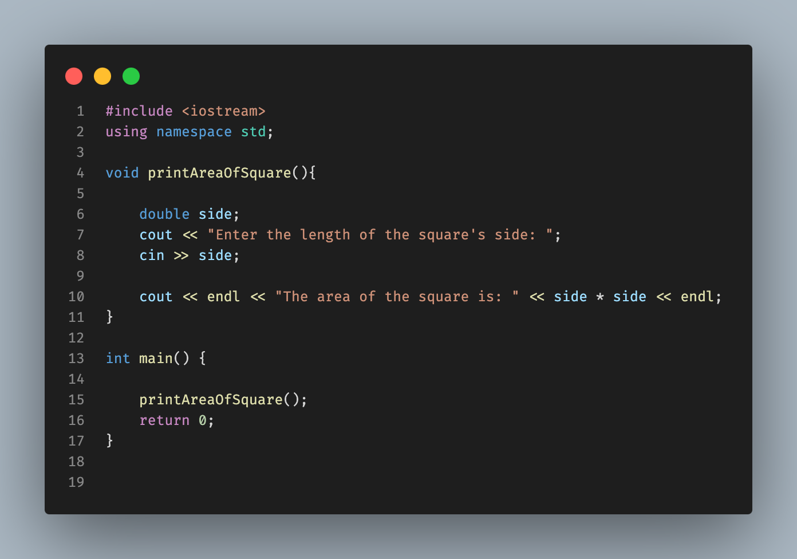

# Functions

C++ functions allows us to modularize our program code, It allows us to break code into logical self-contained units. These units can be resused multiple times in the program.

| Without Functions | With Functions |
| --- | --- |
|  |  |

Functions uses the ***Boss-Worker*** analogy, where the boss is the main program and the workers are the functions. The main program calls the functions to perform a specific task.

When you are calling functions in C++, you need to understand the following:

- What it does
- What it needs
- What it returns
- What errors it might produce
- Any constraints on its use

You won't need to know how the functions works internally to use it in your program, unless you are the one who wrote the function. C++ provides us with a lot of libraries that are filled up with loads of functions that you can use in your program.

> [!IMPORTANT]
> Don't reinvent the wheel, if there is a function that does what you want, use it.

## Function Definition

In this section, we define how the function would works, what it needs, returns, errors it might produce and any constraints on its use and to achieve this, There are some rules that we need to follow:

- Name of the function

  - The rules for naming a function are the same as the rules for naming a variable **(look at [Variables & Constants branch](https://github.com/MagedGDEV/CppInsights/tree/variables) for more information)**.
  - The name of the function should be descriptive and should reflect the purpose of the function so that it is easy to understand what the function does just by looking at its name, such as: (`calculateArea`, `calculateVolume`, `calculateSum`, etc).

- Return type

  - The return type of the function is the type of the value that the function returns at the end of it's execution, such as: `int`, `double`, `float`, `char`, `string`, `bool`, etc.
  - If the function does not return any value, then the return type of the function is `void`.

- Parameters

  - The parameters are the values that the function needs to perform its task. The parameters are optional.
  - If the function does not need any value to perform its task, then the function does not need any parameters.
  - The parameters are enclosed in parentheses `()` and separated by commas `,`. The parameters are defined by their type and name, such as: `int length`, `double radius`, `char letter`, etc.

- Function Body

  - The function body is the block of code that performs the task of the function. The function body is enclosed in curly braces `{}`. The function body contains the code that performs the task of the function.

- Return Statement

  - The return statement is used to return a value from the function.
  - If the return type of the function is `void`, then the return statement may not be used.
  - If the return type of the function is not `void`, then the return statement must be used to return a value of the same type as the return type of the function.

The syntax of the function definition is as follows:

```cpp
return_type function_name(parameters) {
    // function body
    // return statement
}
```

The following example shows different function definitions:

```cpp
// Function that does not return any value and does not need any parameter
void printHello() {
    cout << "Hello, World!" << endl;
}

// Function that does not return any value and needs two parameters
void printSum(int a, int b) {
    cout << "The sum of " << a << " and " << b << " is " << a + b << endl;
}

// Function that returns an integer value and needs two parameters
int calculateSum(int a, int b) {
    return a + b;
}

// Function that does not return ant value and needs a parameter
void printAreaOfSquare(double side) {
    cout << "The area of the square with side " << side << " is " << side * side << endl;
}
```

To call a function, you simply write the name of the function followed by parentheses `()` and the values of the parameters (if any). The following example shows how to call the previous functions:

```cpp
int main() {
    printHello(); // Output: Hello, World!
    printSum(5, 3); // Output: The sum of 5 and 3 is 8
    cout << calculateSum(5, 3) << endl; // Output: 8
    printAreaOfSquare(5); // Output: The area of the square with side 5 is 25
    return 0;
}
```

> [!CAUTION]
> The function must be defined before it is called (before main function). If the function is defined after it is called, the compiler will produce an error because it does not know the definition of the function.

| Error | Solution |
| --- | --- |
|  |  |

## Function Prototypes

As the program grows, the number of functions will increase and the function definitions will be scattered throughout the program. This makes the program difficult to read and understand. To solve this problem, we can use function prototypes.

The function prototype is a declaration of the function that tells the compiler about the function name, return type, and parameters. The function prototype does not contain the function body. The function prototype is used to tell the compiler about the function before the function is called.

The syntax of the function prototype is as follows:

```cpp
return_type function_name(parameters);
```

The following example shows how to use function prototypes:

```cpp
// Function prototypes
void printHello();
void printSum(int a, int b);;

int main() {

    printHello(); // Output: Hello, World!
    printSum(5, 3); // Output: The sum of 5 and 3 is 8
    return 0;
}

// Function definitions
void printHello() {
    cout << "Hello, World!" << endl;
}

void printSum(int a, int b) {
    cout << "The sum of " << a << " and " << b << " is " << a + b << endl;
}
```

You do not need to use function prototypes if the function is defined before it is called. However, it is a good practice to use function prototypes to make the program more readable and understandable.

In the prototype, you only need to specify the function name, return type, and parameters. You do not need to specify the parameter names. The following example shows the function prototype for the `calculateSum` function:

```cpp
int calculateSum(int, int);
```

> [!TIP]
> But it is good practice to specify the parameter names in the function prototype for documentation and better understanding of the function.
